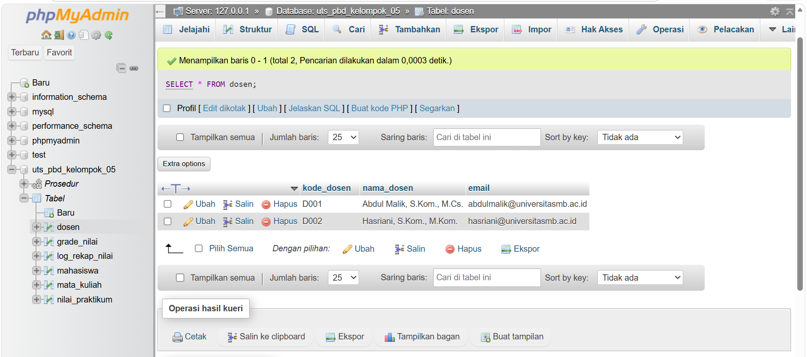
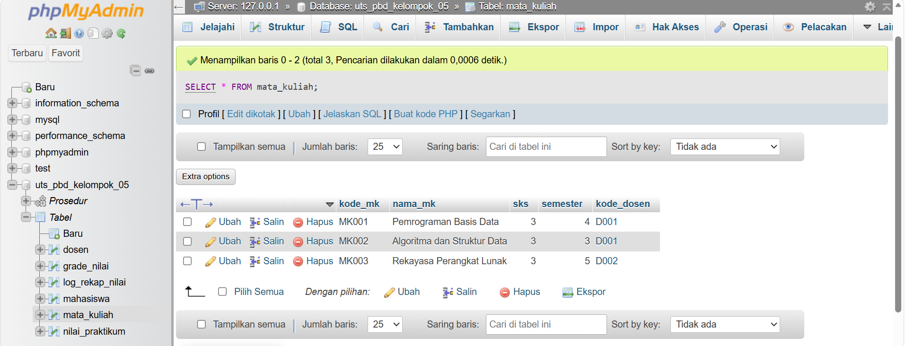

# 📚 SISTEM REKAP NILAI PRAKTIKUM MAHASISWA

## 👥 Kelompok 05

### Daftar Anggota

| No | Nama                  | NIM       |
| -- | --------------------- | --------- |
| 1  | Periyanti Rayo        | IK2411006 |
| 2  | Nur Fahila Dwi Irfani | IK2411031 |
| 3  | Fadhila Suardi        | IK2411018 |
| 4  | Hijryanti             | IK2411015 |
| 5  | Riadarmawangsi        | IK2411056 |

---

# 📝 Deskripsi Sistem

Sistem Rekap Nilai Praktikum Mahasiswa merupakan sistem basis data yang dibuat untuk membantu dosen dalam mengelola dan merekap nilai praktikum mahasiswa secara otomatis menggunakan MySQL melalui XAMPP/phpMyAdmin.

### Fitur Sistem

✅ Menyimpan data mahasiswa, dosen, dan mata kuliah

✅ Menyimpan data nilai praktikum mahasiswa

✅ Menghitung nilai akhir secara otomatis

✅ Menentukan grade dan bobot nilai

✅ Menentukan status kelulusan mahasiswa

✅ Menyimpan riwayat proses rekap nilai ke dalam tabel log

### Konsep Pemrograman Basis Data yang Digunakan

* Variabel Lokal (DECLARE)
* Percabangan (CASE dan IF)
* Perulangan (LOOP)
* Implicit Cursor (ROW_COUNT())
* Explicit Cursor (DECLARE CURSOR)
* Cursor dengan Parameter
* Stored Procedure

---

# 🗄️ Struktur Tabel

## 1. Tabel Mahasiswa

| Kolom    | Tipe Data    |
| -------- | ------------ |
| nim      | VARCHAR(15)  |
| nama     | VARCHAR(100) |
| kelas    | VARCHAR(10)  |
| angkatan | YEAR         |

## 2. Tabel Dosen

| Kolom      | Tipe Data    |
| ---------- | ------------ |
| kode_dosen | VARCHAR(10)  |
| nama_dosen | VARCHAR(100) |
| email      | VARCHAR(100) |

## 3. Tabel Mata Kuliah

| Kolom      | Tipe Data    |
| ---------- | ------------ |
| kode_mk    | VARCHAR(10)  |
| nama_mk    | VARCHAR(100) |
| sks        | TINYINT      |
| semester   | TINYINT      |
| kode_dosen | VARCHAR(10)  |

## 4. Tabel Grade Nilai

| Kolom       | Tipe Data    |
| ----------- | ------------ |
| grade       | VARCHAR(5)   |
| bobot       | DECIMAL(4,2) |
| nilai_bawah | DECIMAL(6,2) |
| nilai_atas  | DECIMAL(6,2) |

## 5. Tabel Nilai Praktikum

| Kolom        | Tipe Data    |
| ------------ | ------------ |
| id_nilai     | INT          |
| nim          | VARCHAR(15)  |
| kode_mk      | VARCHAR(10)  |
| nilai_tugas  | DECIMAL(5,2) |
| nilai_kuis   | DECIMAL(5,2) |
| nilai_uts    | DECIMAL(5,2) |
| nilai_akhir  | DECIMAL(5,2) |
| grade        | VARCHAR(5)   |
| bobot        | DECIMAL(4,2) |
| status_lulus | VARCHAR(15)  |

## 6. Tabel Log Rekap Nilai

| Kolom        | Tipe Data    |
| ------------ | ------------ |
| id_log       | INT          |
| nim          | VARCHAR(15)  |
| kode_mk      | VARCHAR(10)  |
| nilai_akhir  | DECIMAL(5,2) |
| grade        | VARCHAR(5)   |
| bobot        | DECIMAL(4,2) |
| status_lulus | VARCHAR(15)  |
| keterangan   | VARCHAR(255) |
| waktu_proses | DATETIME     |

---

# 🔗 Relasi Antar Tabel

* dosen (1) ➜ (N) mata_kuliah
* mahasiswa (1) ➜ (N) nilai_praktikum
* mata_kuliah (1) ➜ (N) nilai_praktikum
* grade_nilai (1) ➜ (N) nilai_praktikum

---

# ▶️ Cara Menjalankan Program

### 1. Jalankan XAMPP

* Aktifkan Apache
* Aktifkan MySQL

### 2. Buka phpMyAdmin

http://localhost/phpmyadmin

### 3. Import Database

* Buat database baru.
* Import file SQL proyek.

### 4. Jalankan Script SQL

Pastikan seluruh tabel, data awal, dan stored procedure berhasil dibuat.

### 5. Eksekusi Stored Procedure

Menjalankan rekap seluruh data:

```sql
CALL rekap_semua_nilai();
```

Menjalankan rekap berdasarkan mata kuliah:

```sql
CALL rekap_nilai_per_mk('MK001');
```

---

# ⚙️ Daftar Stored Procedure

## 1. rekap_semua_nilai()

Fungsi:

* Menghitung nilai akhir seluruh mahasiswa.
* Menentukan grade.
* Menentukan bobot nilai.
* Menentukan status kelulusan.
* Menyimpan hasil ke tabel log.

Contoh:

```sql
CALL rekap_semua_nilai();
```

---

## 2. rekap_nilai_per_mk()

Fungsi:

* Menghitung nilai akhir berdasarkan kode mata kuliah tertentu.
* Menentukan grade dan status kelulusan.
* Menyimpan riwayat proses ke tabel log.

Contoh:

```sql
CALL rekap_nilai_per_mk('MK001');
```

---

# 📊 Rumus Nilai Akhir

Nilai akhir dihitung menggunakan rumus:

```text
(Tugas × 30%) + (Kuis × 30%) + (UTS × 40%)
```

---

# 👨‍💻 Pembagian Tugas Anggota

| Nama                  | Tugas                                                                  |
| --------------------- | ---------------------------------------------------------------------- |
| Fadhila Suardi        | Membuat database, tabel, relasi, dan data awal                         |
| Nur Fahila Dwi Irfani | Membuat perhitungan nilai akhir menggunakan variabel                   |
| Riadarmawangsi        | Membuat percabangan grade, bobot, status kelulusan, dan perulangan     |
| Hijryanti             | Membuat implicit cursor, explicit cursor, dan cursor dengan parameter  |
| Periyanti Rayo        | Membuat dokumentasi, laporan PDF, README GitHub, dan pengujian program |

---

# 📸 Screenshot Hasil Program

# 📸 Screenshot Hasil Program

## Data Awal

### Tabel Dosen



### Tabel Mata Kuliah



### Tabel Grade Nilai


### Tabel Nilai Praktikum


### Tabel Log Rekap Nilai


---

## Hasil Eksekusi Procedure

### CALL rekap_semua_nilai();

📷 Tambahkan screenshot hasil eksekusi procedure:


### Tabel Nilai Praktikum Setelah Rekap


### Tabel Log Rekap Nilai Setelah Rekap


---

### CALL rekap_nilai_per_mk('MK001');


### Tabel Log Setelah Rekap MK001


# ✅ Kesimpulan

Sistem Rekap Nilai Praktikum Mahasiswa berhasil dibangun menggunakan MySQL dengan menerapkan seluruh konsep Pemrograman Basis Data yang meliputi variabel, percabangan, perulangan, implicit cursor, explicit cursor, cursor dengan parameter, dan stored procedure.

Sistem mampu menghitung nilai akhir secara otomatis, menentukan grade dan status kelulusan mahasiswa, serta menyimpan seluruh riwayat proses ke dalam tabel log sehingga proses rekap nilai menjadi lebih cepat, akurat, dan terstruktur.
